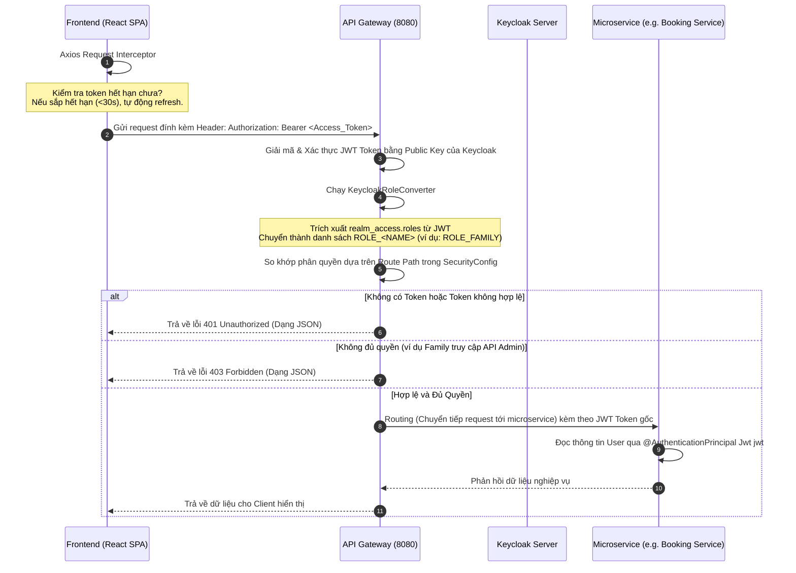

# Hướng Dẫn Kiến Trúc Hệ Thống & Luồng Nghiệp Vụ (HomeCare System Architecture & Flow)

Tài liệu này mô tả chi tiết cách thức hoạt động của hệ thống HomeCare, cơ cấu tổ chức code ở cả phía Back-end (BE) và Front-end (FE), cơ chế xác thực tập trung bằng Keycloak, và vai trò của các thư viện được sử dụng.

---

## 1. Luồng Hoạt Động Của Hệ Thống (System Flow)

Hệ thống hoạt động theo mô hình Microservices kết hợp với cơ chế xác thực tập trung OAuth2 / OIDC qua Keycloak Server. Dưới đây là các luồng hoạt động chính:

### Luồng Đăng Nhập & Xác Thực (Authentication Flow)

```mermaid
sequenceDiagram
    autonumber
    actor User as Người dùng
    participant FE as Frontend (React SPA)
    participant KC as Keycloak Server
    participant GW as API Gateway (8080)
    participant US as User Service (8081)

    (SSO Silent Check): Đây là kỹ thuật "đỉnh" của Keycloak. Thay vì bắt user đăng nhập ngay lập tức, ứng dụng kiểm tra âm thầm xem trong trình duyệt đã có Session nào với Keycloak chưa. Nếu có (do user vừa login ở tab khác), nó lấy token luôn -> UX cực tốt.
    "check-sso": Đây là chế độ quan trọng nhất của Keycloak JS adapter. Khi khởi tạo, thay vì hiện form login luôn, nó sẽ mở một iframe "tàng hình" bên dưới. Nó hỏi Keycloak: "Hey, ông có biết tôi là ai không?". Nếu ông đã login từ tab khác thì nó trả về token luôn. Nếu chưa thì nó im lặng.

    (Login Portal): Khi user chủ động login, ứng dụng không tự xử lý mật khẩu (tránh việc website của bạn chạm vào pass người dùng - cực kỳ an toàn). Bạn redirect sang trang của Keycloak, sau khi Keycloak xác thực xong, nó redirect ngược lại FE của bạn kèm theo Authorization Code.
    "mode: 'login'": Khi gọi keycloak.login(), nếu bạn không truyền tham số gì, mặc định nó sẽ mở giao diện login. Nhưng vì bạn đã cấu hình 'check-sso' trước đó, nên nếu user đã có token thì nó sẽ không hiện form, còn nếu chưa có thì nó sẽ dẫn bạn đến Login Portal.
    
    (Đồng bộ - "Bridge"): Đây là bước quan trọng nhất mà bạn đã hiện thực hóa. Khi FE gọi /api/v1/users/profile bằng Token vừa nhận được, Backend (User Service) sẽ:
    * Dùng Token để định danh người dùng.
    * Kiểm tra xem trong DB đã có hồ sơ chưa? Nếu chưa -> Tạo mới (stub).
    -> Kết quả: User có một "nhân dạng" trong hệ thống nghiệp vụ của bạn.

    -----------------------------------------------------------------------------------------------------------------------
    FE->>FE: Khởi chạy ứng dụng (main.tsx)
    FE->>KC: Gọi initKeycloak() với chế độ 'check-sso'
    Note over FE,KC: Kiểm tra âm thầm qua iframe xem người dùng đã đăng nhập chưa
    ALT Đã đăng nhập từ trước (SSO)
        KC-->>FE: Trả về tokens (Access, Refresh, ID Token)
        FE->>FE: Mount React App (Chế độ Đăng nhập)
    ELSE Chưa đăng nhập
        KC-->>FE: Trả về trạng thái Chưa xác thực
        FE->>FE: Mount React App (Chế độ Khách / Guest Mode)
    END

    User->>FE: Click nút "Đăng nhập" hoặc truy cập Protected Route
    FE->>KC: Chuyển hướng trình duyệt đến trang Login Portal (keycloak.login())
    User->>KC: Nhập Email/Password và xác nhận
    KC-->>FE: Xác thực thành công, redirect kèm Authorization Code
    FE->>KC: Trao đổi Code lấy Access Token JWT, ID Token & Refresh Token 
    FE->>US: Lấy thông tin Profile (/api/v1/users/profile)
    US->>US: Đồng bộ thông tin người dùng vào DB cục bộ (nếu là lần đầu)
    FE->>User: Hiển thị Dashboard theo vai trò (Role) tương ứng
```

### Luồng Gọi API Và Phân Quyền (API Call & Authorization Flow)



---

## 2. Cách Tổ Chức Microservices (Microservice Architecture)

Hệ thống được thiết kế theo mô hình kiến trúc phân tán. Mỗi microservice đảm nhận một miền nghiệp vụ riêng biệt và sở hữu cơ sở dữ liệu độc lập (Database-per-service).

### Danh Sách Các Services và Cổng Lắng Nghe (Port Mapping)

| Cổng (Port) | Tên Service | Vai Trò & Nhiệm Vụ | Cơ Sở Dữ Liệu |
| :--- | :--- | :--- | :--- |
| **8080** | `api-gateway` | Cổng vào duy nhất (Entry Point) của toàn bộ request từ FE. Đảm nhận nhiệm vụ: định tuyến (Routing), quản lý CORS, xác thực và phân quyền tập trung bằng JWT. | *Không dùng DB* |
| **8761** | `eureka-server` | Đăng ký và phát hiện dịch vụ (Service Registry & Discovery). Các microservices đăng ký IP/Port tại đây để kết nối nội bộ khi scale. | *Không dùng DB* |
| **8081** | `user-service` | Quản lý thông tin tài khoản người dùng, hồ sơ bệnh nhân (Patient) và các thành viên gia đình (Family). Phụ trách đồng bộ và tích hợp với Keycloak Admin Client. | `homecare_user_db` (PostgreSQL) |
| **8082** | `caregiver-service`| Quản lý thông tin chi tiết về người chăm sóc (Caregiver Profile): chứng chỉ, kỹ năng, lịch rảnh rỗi, mức giá dịch vụ. | `homecare_caregiver_db` |
| **8083** | `booking-service` | Quản lý vòng đời dịch vụ: yêu cầu chăm sóc, tạo hợp đồng (Contract), lịch trình làm việc (Schedule), và nhật ký chăm sóc hàng ngày (Care Logs). | `homecare_booking_db` |
| **8084** | `payment-service` | Xử lý thanh toán hóa đơn, tích hợp các cổng thanh toán điện tử. | `homecare_payment_db` |
| **8085** | `notification-service` | Gửi thông báo đẩy thời gian thực (Real-time Notification) đến FE qua WebSocket / STOMP. | `homecare_notification_db` |

---

## 3. Cấu Trúc Thư Mục & Vai Trò Từng Thành Phần

### A. Phía Back-End (Spring Boot Service)
Tất cả các microservices đều tuân thủ cấu trúc package chuẩn hóa như sau (Ví dụ trong `user-service`):

```
user-service/src/main/java/org/example/userservice/
├── controller/         # Lớp biên tiếp nhận REST API request
├── dto/                # Data Transfer Objects (Request/Response Payloads)
├── entity/             # Các JPA Entity ánh xạ trực tiếp xuống cơ sở dữ liệu
├── repository/         # Các interface JPA thao tác trực tiếp với Database
├── service/            # Interface khai báo các chức năng nghiệp vụ
│   └── impl/           # Hiện thực hóa chi tiết logic nghiệp vụ (Service Implementation)
├── mapper/             # Định nghĩa chuyển đổi Entity <-> DTO (sử dụng MapStruct)
├── exception/          # Quản lý lỗi nghiệp vụ và Global Exception Handling
├── validation/         # Định nghĩa các ràng buộc và Annotation kiểm tra dữ liệu tùy chỉnh
└── UserServiceApplication.java
```

#### Chi Tiết Nhiệm Vụ Từng Package:
1. **`controller`**:
   - Tiếp nhận HTTP requests từ API Gateway gửi tới.
   - Sử dụng các annotation như `@GetMapping`, `@PostMapping`, `@PutMapping`, `@DeleteMapping` để định nghĩa endpoint.
   - Sử dụng `@Valid` để kích hoạt kiểm tra dữ liệu đầu vào.
   - Nhận thông tin người dùng đăng nhập hiện tại trực tiếp từ JWT bằng `@AuthenticationPrincipal Jwt jwt`.
2. **`dto`**:
   - Chứa các Record hoặc Class đại diện cho cấu trúc dữ liệu gửi lên (`Request`) hoặc trả về (`Response`).
   - Giúp bảo mật cấu trúc bảng cơ sở dữ liệu bên dưới, che giấu các trường nhạy cảm (như mật khẩu, dữ liệu hệ thống) trước khi gửi về FE.
3. **`entity`**:
   - Các class được đánh dấu `@Entity`. Đại diện cho các bảng trong database.
   - Định nghĩa quan hệ giữa các bảng (ví dụ: quan hệ một-nhiều `@OneToMany` giữa `User` và `Patient`).
   - Sử dụng cơ chế Soft Delete (xóa mềm) thông qua cấu hình `@SQLDelete(sql = "UPDATE ... SET deleted = true")` và lọc tự động `@SQLRestriction("deleted = false")`.
4. **`repository`**:
   - Kế thừa `JpaRepository<Entity, ID>`.
   - Cung cấp các phương thức CRUD có sẵn của Spring Data JPA.
   - Hỗ trợ khai báo các câu truy vấn động (Query Methods) như `findByKeycloakId` hay `existsByPhoneAndKeycloakIdNot`.
5. **`service` & `impl`**:
   - Nơi tập trung toàn bộ **Logic Nghiệp Vụ** (Business Logic) của hệ thống.
   - Đảm bảo tính toàn vẹn của dữ liệu bằng cách sử dụng `@Transactional` của Spring.
   - Tương tác với `repository` để truy xuất DB, tương tác với các client bên ngoài (như gọi sang Keycloak Server) và chuyển đổi dữ liệu qua `mapper`.
6. **`mapper`**:
   - Định nghĩa các interface chuyển đổi cấu trúc dữ liệu qua lại giữa Entity và DTO.
   - Sử dụng **MapStruct** để tự động tạo mã nguồn thực thi lúc biên dịch (Compile time), giúp tăng hiệu suất hệ thống so với việc dùng Reflection (như BeanUtils).
7. **`exception`**:
   - Chứa các ngoại lệ tùy chỉnh như `UserNotFoundException`, `DuplicatePhoneException`.
   - Có một lớp Global Exception Handler (thường đánh dấu `@RestControllerAdvice`) để bắt tất cả các lỗi xảy ra trong hệ thống và đóng gói thành phản hồi JSON thống nhất gửi về FE (gồm timestamp, HTTP status, và thông điệp lỗi rõ ràng).

---

### B. Phía Front-End (React + Vite + TypeScript)
Mã nguồn React được tổ chức logic, tường minh và trực quan:

```
homecareFE/src/
├── assets/             # Hình ảnh tĩnh, icons, logos của ứng dụng
├── components/         # Các component UI tái sử dụng
│   ├── layouts/        # Layout chung (MainLayout, FamilyLayout có Sidebar/Topbar, AdminLayout)
│   └── ui/             # Các phần tử giao diện cơ bản (Button, Select, Input, Dialog...)
├── data/               # Các dữ liệu mock hoặc hằng số cấu hình hệ thống
├── hooks/              # Các Custom React Hooks phục vụ xử lý logic giao diện
├── lib/                # Cấu hình thư viện dùng chung (như hàm css merge clsx)
├── pages/              # Chứa các màn hình hiển thị chính (Dashboard, Profile, Patients, v.v.)
├── routes/             # Cấu hình hệ thống định tuyến (AppRoutes, ProtectedRoute)
├── services/           # Các module kết nối API bên ngoài (api.service, keycloak)
├── types/              # Các file định nghĩa kiểu TypeScript (.d.ts hoặc .ts)
├── App.tsx             # Component gốc thiết lập các Context Providers (React Query, Router, Toaster)
├── main.tsx            # Điểm khởi chạy ứng dụng (nơi Keycloak được init trước)
└── index.css           # Cấu hình Tailwind CSS cơ bản
```

#### Chi Tiết Nhiệm Vụ Từng Thư Mục FE:
1. **`services/keycloak.ts`**:
   - Khởi tạo đối tượng `Keycloak` của thư viện `keycloak-js` sử dụng các thông số từ file môi trường `.env`.
   - Thực thi hàm `initKeycloak` với tuỳ chọn `check-sso`.
   - Tích hợp cơ chế **Timeout phòng ngừa lỗi (2 giây)**: Nếu máy chủ Keycloak không phản hồi trong vòng 2 giây, hệ thống sẽ bỏ qua và tự động khởi động ứng dụng React dưới chế độ Khách (Guest Mode) thay vì treo màn hình trắng.
2. **`services/api.service.ts`**:
   - Sử dụng Axios để thiết lập kết nối tới API Gateway (`http://localhost:8080`).
   - **Request Interceptor**: Trước khi gửi bất kỳ request nào lên BE, interceptor này sẽ kiểm tra xem người dùng đã đăng nhập chưa. Nếu có, nó tự động gọi `keycloak.updateToken(30)` để làm mới token nếu thời gian hết hạn còn dưới 30 giây, sau đó gắn token mới nhất vào header `Authorization: Bearer <Token>`.
   - **Response Interceptor**: Lắng nghe phản hồi từ máy chủ.
     - Nếu nhận được mã lỗi `401 Unauthorized` từ Gateway/Microservice, hệ thống sẽ thực hiện thử lại (Retry) bằng cách bắt buộc làm mới token (`keycloak.updateToken(-1)`). Nếu làm mới thành công, request lỗi trước đó sẽ được gửi lại với token mới mà người dùng không nhận ra gián đoạn gì. Nếu refresh thất bại (session hoàn toàn hết hạn), người dùng sẽ được chuyển hướng về cổng đăng nhập.
     - Nếu nhận lỗi `403 Forbidden`, hệ thống hiển thị thông báo popup cảnh báo không đủ quyền truy cập tài nguyên.
3. **`routes/ProtectedRoute.tsx`**:
   - Bộ bảo vệ định tuyến (Route Guard).
   - Kiểm tra trạng thái `keycloak.authenticated`. Nếu chưa đăng nhập, component sẽ hiển thị một vòng xoay tải trang (loading spinner) đẹp mắt và tự động gọi `keycloak.login()` để đưa người dùng tới Keycloak portal. Nếu đã đăng nhập, nó cho phép render component con (`children`).
4. **`pages/family/familyProfile.tsx`**:
   - Giao diện quản lý hồ sơ gia đình.
   - Sử dụng thư viện **React Query** (`useQuery`) để gửi request lấy thông tin profile và hiển thị lên form.
   - Sử dụng **React Hook Form** để quản lý trạng thái form hiệu quả và tối ưu số lần re-render.
   - Hỗ trợ tải lên ảnh đại diện dạng base64 qua API `/avatar`. Khi cập nhật thành công, nó gọi `queryClient.invalidateQueries` để cập nhật lập tức ảnh đại diện trên thanh Topbar/Sidebar mà không cần tải lại trang.

---

## 4. Nghiệp Vụ CRUD & Profile Hoạt Động Như Thế Nào?

Để đảm bảo tính nhất quán của dữ liệu nghiệp vụ và hệ thống phân quyền Keycloak, các quy trình CRUD và Profile được thực hiện chặt chẽ:

### Quy Trình Tạo Mới Người Dùng (Create User)
Khi quản trị viên (Admin) tạo một tài khoản mới thông qua giao diện Quản lý người dùng:

```
[FE: Điền thông tin & Click Tạo]
              │
              ▼
[BE: UserController -> UserService.createUser()]
              │
              ▼
[1. Kiểm tra trùng lặp Email/Phone trong Database cục bộ]
              │
              ▼
[2. Gọi KeycloakService.createUser() thông qua Keycloak Admin Client]
   ├── Chuẩn bị thông tin tài khoản (UserRepresentation) gồm Username (Email), Email, Họ tên, Sđt.
   ├── Gửi yêu cầu POST tạo tài khoản lên Keycloak Server.
   └── Gán vai trò (Role) tương ứng vào tài khoản trên Keycloak (ví dụ: FAMILY, CAREGIVER).
              │
              ▼
[3. Ghi nhận thông tin tài khoản xuống Database cục bộ]
   ├── Lấy UUID (keycloakId) trả về từ Keycloak gán vào Entity User.
   └── Lưu User xuống DB cục bộ.
              │
      ┌───────┴───────┐
   Thành công       Thất bại (Ví dụ lỗi kết nối DB, lỗi ghi đè dữ liệu)
      │               │
      ▼               ▼
[Trả về DTO mới]   [Rollback: Gọi Keycloak API để XÓA tài khoản vừa tạo trên Keycloak]
                      │
                      ▼
                   [Báo lỗi về cho Frontend hiển thị]
```

### Luồng Đồng Bộ Tài Khoản Lần Đầu Đăng Nhập (Sync User on First Login)
Khi người dùng tự đăng ký tài khoản trực tiếp trên giao diện Keycloak, cơ sở dữ liệu cục bộ của `user-service` chưa hề có thông tin của họ.

1. Khi đăng nhập thành công vào FE, FE gọi API lấy hồ sơ cá nhân: `GET /api/v1/users/profile`.
2. Đầu tiên, `ProfileController` chuyển quyền xử lý sang lớp `AuthSyncService.syncUser(jwt)`.
3. `AuthSyncService` kiểm tra sự tồn tại của `keycloakId` (lấy từ trường `sub` trong JWT) trong database:
   - **Trường hợp đã tồn tại**: Bỏ qua và tiếp tục xử lý lấy thông tin.
   - **Trường hợp đã tồn tại Email nhưng chưa có Keycloak ID** (Admin đã tạo trước bản ghi nghiệp vụ bằng Email từ trước nhưng người dùng mới đăng nhập lần đầu): Cập nhật `keycloakId` vào bản ghi và lưu lại.
   - **Trường hợp hoàn toàn mới**: Phân tích quyền hạn của người dùng từ claim `realm_access.roles` của JWT, sau đó tạo một bản ghi User stub mới trong DB cục bộ với các trường cơ bản lấy từ Token (Họ tên từ `name`, Email từ `email`) để đồng bộ dữ liệu.

### Cập Nhật Hồ Sơ Của Người Dùng (Update Profile)
1. Người dùng cập nhật Họ tên, Sđt, Địa chỉ thông qua Form trên Frontend.
2. Frontend gửi request `PUT /api/v1/users/profile`.
3. `UserService` nhận yêu cầu, cập nhật thông tin xuống DB cục bộ.
4. **Đồng bộ ngược lại Keycloak**: Để đảm bảo Keycloak luôn giữ thông tin họ tên chính xác phục vụ cho các dịch vụ khác (ví dụ: hiển thị tên trong token), Service sử dụng Access Token của chính người dùng gửi request POST đến Account API của Keycloak (`/realms/homecare-realm/account`) để cập nhật trường `firstName` và `lastName` trên Keycloak Server.

### Quy Trình Quản Lý Bệnh Nhân (Patient Management Flow)
Để quản lý hồ sơ sức khỏe gia đình hiệu quả và an toàn, luồng quản lý Bệnh nhân (Patient) tuân thủ các quy tắc sau:

1. **Phân quyền thao tác (Role-based Authorization):**
   * Tài khoản **FAMILY** chỉ có quyền CRUD các bệnh nhân thuộc sở hữu của gia đình họ (được xác thực an toàn bằng cách so khớp `patient.getFamily().getId()` với `user.getId()`).
   * Tài khoản **ADMIN** và **OPERATOR** có quyền xem và cập nhật tất cả thông tin bệnh nhân trên hệ thống.
2. **Quy tắc phân vùng cập nhật thuộc tính:**
   * **FAMILY** có quyền cập nhật các thông tin cơ bản (Họ tên, ngày sinh, giới tính, quan hệ, địa chỉ, lịch sử y tế), nhưng **không** được cập nhật trạng thái (`status`) và tình trạng hiện tại (`currentCondition`) của bệnh nhân.
   * **ADMIN / OPERATOR** có quyền cập nhật toàn bộ thuộc tính bao gồm cả `status` và `currentCondition`.
3. **Bảo vệ dữ liệu khi Cập nhật (MapStruct Protection):**
   * Trong [PatientMapper.java](file:///d:/ProjectOJT/user-service/src/main/java/org/example/userservice/mapper/PatientMapper.java), phương thức `updateEntityFromRequest` được cấu hình bỏ qua (`ignore`) hai trường `status` và `currentCondition` để tránh việc MapStruct tự động ghi đè giá trị `null` từ request vào Entity.
   * Việc cập nhật 2 trường này chỉ được thực hiện thủ công trong Service sau khi đã kiểm tra giá trị đầu vào khác `null`.
4. **Cơ chế Soft Delete (Xóa mềm):**
   * Khi xóa bệnh nhân (`DELETE /api/v1/patients/{id}`), hệ thống không xóa vật lý bản ghi trong DB mà kích hoạt xóa mềm thông qua cấu hình `@SQLDelete` và `@SQLRestriction("deleted = false")` để đảm bảo an toàn dữ liệu lịch sử.

---

## 5. Các Thư Viện Được Thêm Và Nhiệm Vụ Của Chúng (Dependencies & Libraries)

### Phía Back-End (Java / Spring Boot)

*   **`keycloak-admin-client` (v24.0.5)**:
    *   *Nhiệm vụ*: Cung cấp thư viện Java SDK chính thức để gọi các REST API quản lý của Keycloak.
    *   *Ứng dụng*: Dùng trong `KeycloakServiceImpl` để tạo người dùng, gán vai trò, xóa người dùng khi tạo tài khoản thất bại (Rollback).
*   **`spring-boot-starter-oauth2-resource-server`**:
    *   *Nhiệm vụ*: Cấu hình microservice trở thành một Resource Server trong luồng OAuth2.
    *   *Ứng dụng*: Tự động chặn các yêu cầu, giải mã JWT token từ Header, xác thực chữ ký số bằng Public Key của Keycloak và chuyển thành đối tượng `Jwt` trong Spring Security context.
*   **`mapstruct` & `mapstruct-processor` (v1.5.5.Final)**:
    *   *Nhiệm vụ*: Thư viện sinh code chuyển đổi dữ liệu (Object Mapping) cực nhanh lúc Compile time.
    *   *Ứng dụng*: Chuyển đổi qua lại giữa `User` entity và `UserDto` tự động thông qua giao diện `UserMapper` mà không cần viết các hàm setter/getter thủ công hoặc dùng reflection làm chậm hệ thống.
*   **`spring-boot-starter-flyway`**:
    *   *Nhiệm vụ*: Quản lý và kiểm soát phiên bản cơ sở dữ liệu (Database Migration).
    *   *Ứng dụng*: Tự động chạy các file script SQL nằm trong `src/main/resources/db/migration` để tạo bảng, thêm cột mỗi khi khởi động ứng dụng, giúp cấu trúc DB của dự án đồng nhất giữa mọi máy lập trình viên.
*   **`lombok`**:
    *   *Nhiệm vụ*: Tạo tự động getters, setters, constructors, builder patterns thông qua các annotation.
    *   *Ứng dụng*: Giúp mã nguồn Java ngắn gọn, sạch sẽ, dễ đọc hơn rất nhiều.

---

## 6. Tổng Kết Quá Trình Đã Thực Hiện Với Keycloak

Dưới đây là tóm tắt những nhiệm vụ bảo mật đã triển khai thành công trên dự án:

1.  **Cấu Hình Phân Quyền Tại API Gateway (`api-gateway`)**:
    *   Tích hợp giải mã token JWT từ máy chủ Keycloak (`http://localhost:8180/realms/homecare-realm`).
    *   Xây dựng lớp `KeycloakRoleConverter` để đọc claim `realm_access.roles` từ JWT của Keycloak, ánh xạ thành các Authority hợp lệ dạng `ROLE_ADMIN`, `ROLE_FAMILY`, `ROLE_CAREGIVER` trong Spring Security.
    *   Thiết lập hàng rào bảo vệ (SecurityWebFilterChain) kiểm tra quyền truy cập theo từng cụm API Path (Ví dụ: Các đường dẫn `/api/v1/admin/**` bắt buộc có quyền `ADMIN`).
    *   Xử lý trả về định dạng lỗi JSON chuyên nghiệp và có thông điệp tiếng Việt thân thiện khi chưa đăng nhập (401) hoặc truy cập trái phép (403).
2.  **Đồng Bộ Hoá Người Dùng Ở User Service (`user-service`)**:
    *   Tích hợp bộ thư viện quản trị `Keycloak Admin Client` để quản lý tài khoản trực tiếp từ hệ thống BE.
    *   Xây dựng Service đồng bộ tự động `AuthSyncService` giúp tự tạo bản ghi cơ sở dữ liệu cục bộ khi người dùng đăng nhập lần đầu tiên mà không bắt nhập lại thông tin.
    *   Hiện thực hóa cơ chế **Rollback an toàn**: Nếu quá trình tạo tài khoản trong database cục bộ xảy ra lỗi sau khi tài khoản Keycloak đã được tạo thành công, hệ thống lập tức gọi API xóa tài khoản vừa tạo trên Keycloak để đảm bảo tính toàn vẹn dữ liệu.
3.  **Tối Ưu Hoá Xác Thực Ở Frontend (`homecareFE`)**:
    *   Cấu hình cơ chế đăng nhập không gây gián đoạn bằng **Check-SSO** kết hợp Iframe ẩn (`silent-check-sso.html`), giúp người dùng mở ứng dụng là tự động nhận diện trạng thái đăng nhập từ trước mà không bị chuyển hướng phiền toái.
    *   Thiết lập **Axios Request Interceptor** tự động theo dõi thời gian sống của token, thực hiện cập nhật token ngầm nếu token còn hiệu lực dưới 30 giây để tránh việc gửi yêu cầu lên server bị từ chối.
    *   Thiết lập **Axios Response Interceptor** xử lý lỗi 401 tự động: Khi nhận lỗi 401 do token hết hạn đột ngột, FE sẽ bắt lấy lỗi, gửi yêu cầu refresh token và tự động gửi lại request bị lỗi trước đó một cách mượt mà.

---

## 7. Tổng Kết Các Thay Đổi Của Phase 5 (Patient Management)

Dưới đây là tóm tắt những nhiệm vụ của Phase 5 - Patient Management đã được hoàn thiện và kiểm tra hoạt động bình thường trên dự án:

1.  **Thiết kế & Tích hợp Module Patient ở Back-end**:
    *   Hoàn thiện toàn bộ luồng REST API bao gồm Entity [Patient.java], Repository [PatientRepository.java], DTOs (`PatientDto`, `PatientRequest`), Mapper [PatientMapper.java], Service [PatientServiceImpl.java] và Controller [PatientController.java].
    *   **Xử lý lỗi 500 (Internal Server Error) của JPA:** Bổ sung `@ExceptionHandler(jakarta.persistence.EntityNotFoundException.class)` tại [GlobalExceptionHandler.java] để chuyển hướng lỗi nạp thực thể không tồn tại về dạng **`404 Not Found`** tiêu chuẩn, kết hợp gắn `@ResponseStatus(HttpStatus.NOT_FOUND)` cho các custom exceptions.
    *   **Null-safety cho các khối điều kiện kiểm tra:** Thêm kiểm tra an toàn `getFamily() == null` trước khi so khớp ID chủ sở hữu để ngăn ngừa lỗi `NullPointerException` tiềm ẩn.
2.  **Xây dựng Giao diện & Tối ưu hóa ở Frontend**:
    *   Thiết lập luồng giao diện danh sách bệnh nhân [PatientList.tsx] và chi tiết bệnh nhân [PatientDetail.tsx]
    *   **Cơ chế lọc bỏ lỗi phiền hà (skipToast):** Triển khai cờ `skipToast: true` tại [api.ts] và [api.service.ts] cho các API phụ trợ/không bắt buộc để tắt hoàn toàn các popups thông báo lỗi khi các microservices ngoài (như booking-service hay incident) đang tạm thời tắt.
